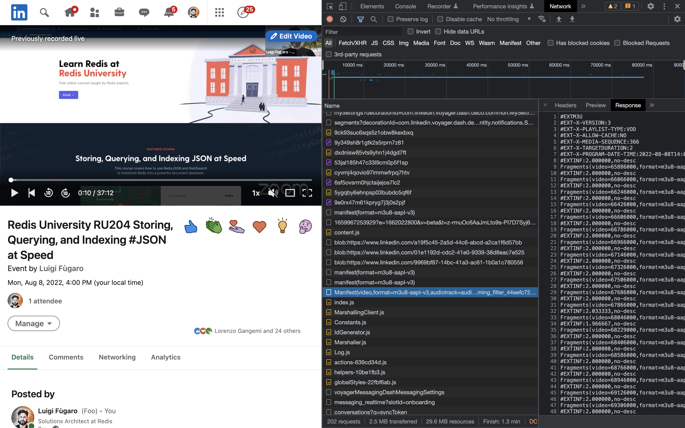
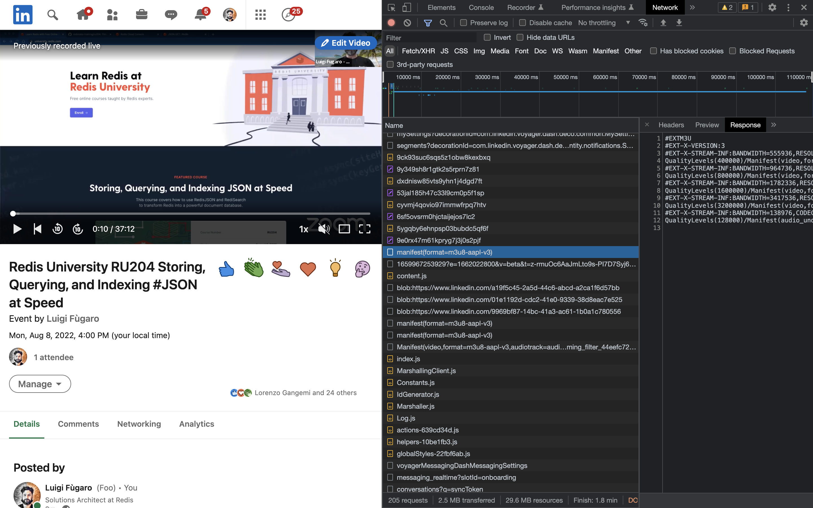
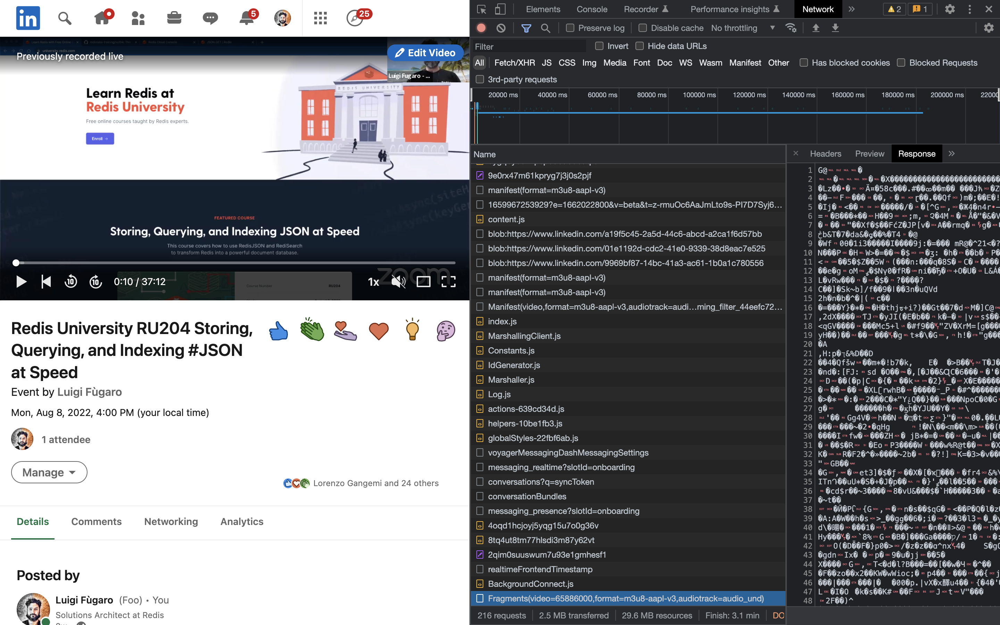
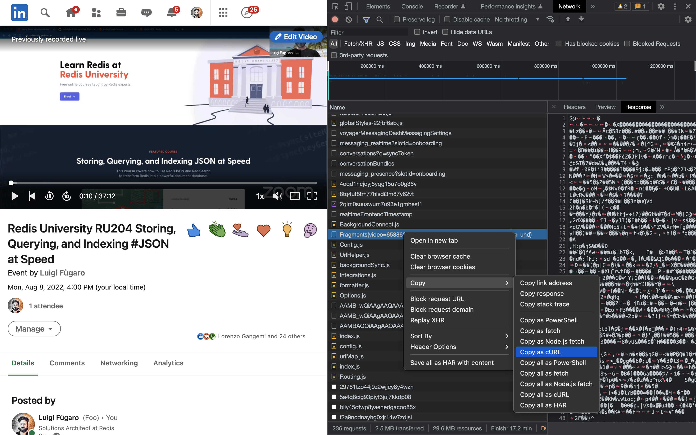
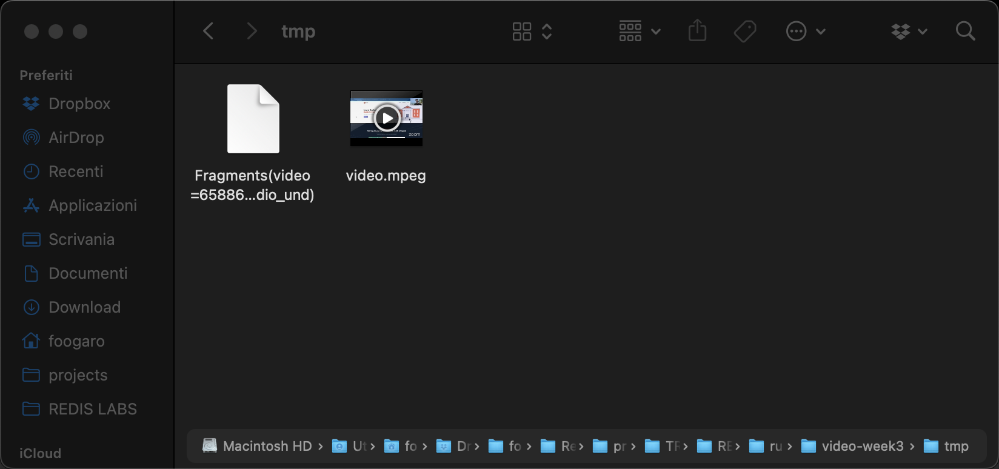
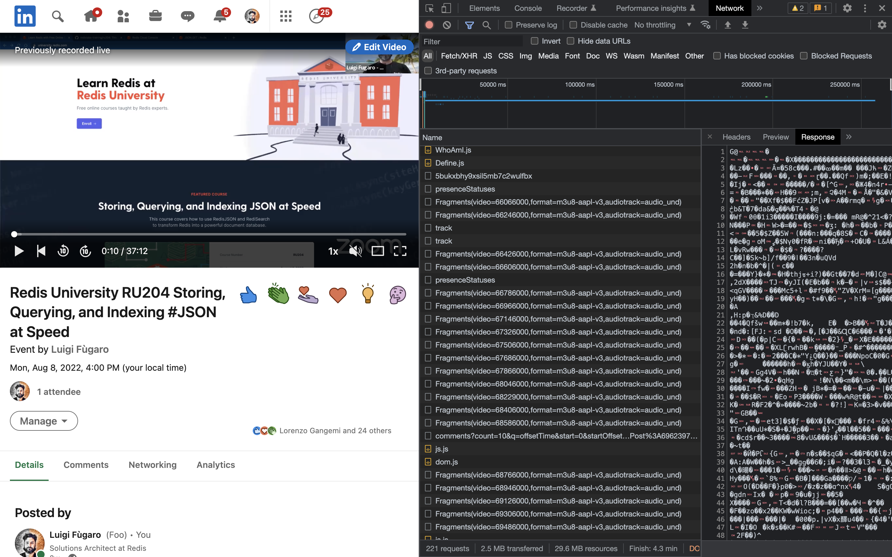

# LinkedIn Video Downloader

# DISCLAIMER
This piece of software is for my personal use, and I am not responsible for the way you are going to use it.
So, stay out of trouble, make jars and not wars!

## Introduction
One of my jobs activities consist of spreading the word about Redis, and this goes also with video and live webinars.
Recently I'm doing LinkedIn lives, broadcasting my live from Zoom, and not all the time I remember to hit the "Record" button.

However, and fortunately, LinkedIn keeps the recording of my live as "Previously recorded live", so that it can be watched later. I have no idea about the retention that LinkedIn provides for those videos, but I'm sure it does not provide a way to download such videos.

So, I googled around, and I couldn't find anything serious. YouTube download, Pinterest downloader, Facebook downloader, but all the downloaders related to LinkedIn were just fake.

Thus, I need to build my own LinkedIn Video Downloader! :expressionless:

## The idea
Now, the idea was... I don't think I will find a link (src or href) to some video into the source[^1] of some sort of format (mp4, webm, vid mkv, avi, mov and so on), but I do think I'll find something related to video streaming... but not in the source[^1], surely at network level.

So, I opened Chrome and its DevTools bar, selected the Network panel, and then I typed (pasted) my LinkedIn video event URL in the address bar and pressed enter!

And that's what I got.


Now I need to find something that rings me a bell in regard to video/stream/chunks/binary/whatever... so I started scrolling the Network panel and after few scrolls I heard the first bell! :bell:



A better look in the same scroll, and I also found other information. :boom:



Yes, metadata, but I know we are getting there!
But let's see what we got so far:
- a request that grabs the resolution and the quality of the video.
- a request that grabs the fragments that compose the video.

Now we need those fragments.

Scrolling down a bit more and here it is the first fragment. :sparkling_heart:



Finally, a binary format! Must be a fragment of the movie.

A quick check with curl...



Open the terminal, copy&paste...

```shell
foogaro@MBP-di-Luigi tmp % curl 'https://streamweu-livectorprodmedia17-euwe.licdn.com/44eefc72-771d-4bfd-8985-aede1310be0f/L4E609f69d951866001-livemanifest.ism/QualityLevels(3200000)/Fragments(video=65886000,format=m3u8-aapl-v3,audiotrack=audio_und)' --compressed
Warning: Binary output can mess up your terminal. Use "--output -" to tell
Warning: curl to output it to your terminal anyway, or consider "--output
Warning: <FILE>" to save to a file.
foogaro@MBP-di-Luigi tmp % curl 'https://streamweu-livectorprodmedia17-euwe.licdn.com/44eefc72-771d-4bfd-8985-aede1310be0f/L4E609f69d951866001-livemanifest.ism/QualityLevels(3200000)/Fragments(video=65886000,format=m3u8-aapl-v3,audiotrack=audio_und)' --compressed -O
  % Total    % Received % Xferd  Average Speed   Time    Time     Time  Current
                                 Dload  Upload   Total   Spent    Left  Speed
100  158k  100  158k    0     0   868k      0 --:--:-- --:--:-- --:--:--  924k
foogaro@MBP-di-Luigi tmp % ll
total 320
drwxr-xr-x  3 foogaro  staff      96 24 Ago 22:37 .
drwxr-xr-x  6 foogaro  staff     192 24 Ago 22:37 ..
-rw-r--r--  1 foogaro  staff  162808 24 Ago 22:37 Fragments(video=65886000,format=m3u8-aapl-v3,audiotrack=audio_und)
foogaro@MBP-di-Luigi tmp % file Fragments\(video=65886000,format=m3u8-aapl-v3,audiotrack=audio_und\)
Fragments(video=65886000,format=m3u8-aapl-v3,audiotrack=audio_und): MPEG transport stream data
foogaro@MBP-di-Luigi tmp % curl 'https://streamweu-livectorprodmedia17-euwe.licdn.com/44eefc72-771d-4bfd-8985-aede1310be0f/L4E609f69d951866001-livemanifest.ism/QualityLevels(3200000)/Fragments(video=65886000,format=m3u8-aapl-v3,audiotrack=audio_und)' --compressed -o video.mpeg
  % Total    % Received % Xferd  Average Speed   Time    Time     Time  Current
                                 Dload  Upload   Total   Spent    Left  Speed
100  158k  100  158k    0     0   926k      0 --:--:-- --:--:-- --:--:--  981k
foogaro@MBP-di-Luigi tmp % ll
total 640
drwxr-xr-x  4 foogaro  staff     128 24 Ago 22:39 .
drwxr-xr-x  6 foogaro  staff     192 24 Ago 22:37 ..
-rw-r--r--  1 foogaro  staff  162808 24 Ago 22:37 Fragments(video=65886000,format=m3u8-aapl-v3,audiotrack=audio_und)
-rw-r--r--  1 foogaro  staff  162808 24 Ago 22:39 video.mpeg
foogaro@MBP-di-Luigi tmp %
```

Let's see if it is a video for real...



It is a real video, and it's about 2 seconds long which matches the TARGETDURATION we found in the complete fragments list. :sweat_drops:

Keep on scrolling and here they are.

Fragments, I see fragments everywhere.



## Other outcomes:
- no authentication required to download the video :unlock:
- no need to keep&pass cookie(s) at each request :cookie:
- no redirects :end:

## Implementation

I'm not going to describe the code, you can take a look at it yourself, but I can tell you what was needed:
- extract the video ID from one of the URLs
- grab the quality/resolution of your video
- adjust the fragment URL to download based on video ID, quality and of course the fragment ID!

The implementation is to be considered at best effort, which means it works on my computer! :computer:

The last piece of the implementation, downloading/streaming the file back, was possible thanks to @swathisprasad (Swathi Prasad) and her repo :octocat: [https://github.com/swathisprasad/download-using-streaming-response-body](https://github.com/swathisprasad/download-using-streaming-response-body)

For the rest, of course thanks to StackOverflow.

## Quick bite

Try it with docker if you want:

```shell
foogaro@MBP-di-Luigi linkedin-video-downloader % docker run -it --rm=true -p 8080:8080 foogaro/linkedin-video-downloader

  .   ____          _            __ _ _
 /\\ / ___'_ __ _ _(_)_ __  __ _ \ \ \ \
( ( )\___ | '_ | '_| | '_ \/ _` | \ \ \ \
 \\/  ___)| |_)| | | | | || (_| |  ) ) ) )
  '  |____| .__|_| |_|_| |_\__, | / / / /
 =========|_|==============|___/=/_/_/_/
 :: Spring Boot ::                (v2.7.0)

2022-08-24 22:57:01.107  INFO 1 --- [           main] c.foogaro.data.LinkedInVideoApplication  : Starting LinkedInVideoApplication v1.0.0 using Java 11.0.16.1 on c543811fe9f3 with PID 1 (/app/app.jar started by root in /app)
2022-08-24 22:57:01.121  INFO 1 --- [           main] c.foogaro.data.LinkedInVideoApplication  : No active profile set, falling back to 1 default profile: "default"
2022-08-24 22:57:03.037  INFO 1 --- [           main] o.s.b.w.embedded.tomcat.TomcatWebServer  : Tomcat initialized with port(s): 8080 (http)
2022-08-24 22:57:03.060  INFO 1 --- [           main] o.apache.catalina.core.StandardService   : Starting service [Tomcat]
2022-08-24 22:57:03.060  INFO 1 --- [           main] org.apache.catalina.core.StandardEngine  : Starting Servlet engine: [Apache Tomcat/9.0.63]
2022-08-24 22:57:03.171  INFO 1 --- [           main] o.a.c.c.C.[Tomcat].[localhost].[/]       : Initializing Spring embedded WebApplicationContext
2022-08-24 22:57:03.171  INFO 1 --- [           main] w.s.c.ServletWebServerApplicationContext : Root WebApplicationContext: initialization completed in 1969 ms
2022-08-24 22:57:03.900  INFO 1 --- [           main] o.s.b.a.w.s.WelcomePageHandlerMapping    : Adding welcome page template: index
2022-08-24 22:57:04.286  INFO 1 --- [           main] o.s.b.a.e.web.EndpointLinksResolver      : Exposing 1 endpoint(s) beneath base path '/actuator'
2022-08-24 22:57:04.363  INFO 1 --- [           main] o.s.b.w.embedded.tomcat.TomcatWebServer  : Tomcat started on port(s): 8080 (http) with context path ''
2022-08-24 22:57:04.391  INFO 1 --- [           main] c.foogaro.data.LinkedInVideoApplication  : Started LinkedInVideoApplication in 3.931 seconds (JVM running for 4.532)
2022-08-24 22:57:05.282  INFO 1 --- [nio-8080-exec-1] o.a.c.c.C.[Tomcat].[localhost].[/]       : Initializing Spring DispatcherServlet 'dispatcherServlet'
2022-08-24 22:57:05.283  INFO 1 --- [nio-8080-exec-1] o.s.web.servlet.DispatcherServlet        : Initializing Servlet 'dispatcherServlet'
2022-08-24 22:57:05.289  INFO 1 --- [nio-8080-exec-1] o.s.web.servlet.DispatcherServlet        : Completed initialization in 4 ms
2022-08-24 22:57:21.779  INFO 1 --- [nio-8080-exec-7] c.f.d.c.LinkedInVideoController          : Steaming video download as: linkedin-video-1661421441774.zip
2022-08-24 22:57:21.800  INFO 1 --- [ taskExecutor-1] c.f.d.c.LinkedInVideoController          : Video ID: c50f2327-7fa7-4cc8-8a2c-35711eb5296d/L4E60a4445e9d065000
2022-08-24 22:57:21.800  INFO 1 --- [ taskExecutor-1] c.f.d.c.LinkedInVideoController          : Quality Level: 3200000
2022-08-24 22:57:21.991  INFO 1 --- [ taskExecutor-1] c.f.d.c.LinkedInVideoController          : Number of video fragments: 2154
```

Thanks for reading so far! :pray:

If you liked or found it useful, give me a star! :star: 

PRs are more than welcome, both on frontend and backend! :thumbsup:


[^1]: I lied, I did look for the link of the video in the source of the page! :sweat_smile:

